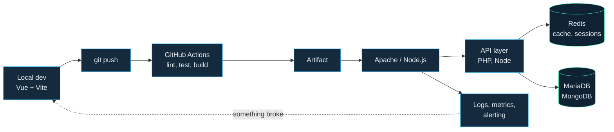
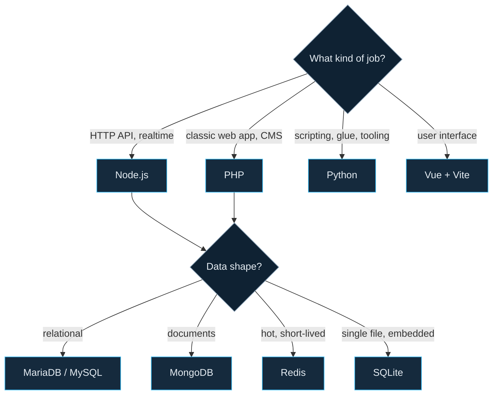

<!--
  Profile README for github.com/maximilianfeix
  Assets live in /assets, automation in /.github/workflows
  Search for "TODO" to find the spots you should personalise.
-->

  <picture>
    <source media="(prefers-color-scheme: dark)" srcset="./assets/header-dark.svg">
    <source media="(prefers-color-scheme: light)" srcset="./assets/header-light.svg">
    
  </picture>

  
  
  
  

---

## About

Software developer from Germany, working at a hosting company. Most of my time goes into the parts users never see: APIs, deployment pipelines, database schemas and the automation that keeps all of it running without me.

- Building backend services in **Node.js** and **PHP**, with **Vue** on the front where a UI is needed
- Comfortable in the ops half of the job: **Apache**, **Redis**, **MariaDB**, cron and shell glue
- Interested in reliability, sensible defaults and scripts that remove repetitive work
- Currently digging deeper into **TODO: z. B. containers, Go, observability**

> Open to interesting backend or infrastructure projects. The fastest way to reach me is Discord.

---

## Stack

| | |
|---|---|
| **Languages** |     |
| **Runtime & frameworks** |    |
| **Data** |      |
| **Infrastructure** |      |
| **Design** |      |

---

## How a change reaches production

<b>What I reach for, and when</b>

 

---

## Projects

<!-- TODO: Ersetze REPO_1 / REPO_2 durch echte Repository-Namen. Karten ohne gültiges Repo zeigen einen Fehler. -->

  
  

---

## Activity

  <picture>
    <source media="(prefers-color-scheme: dark)" srcset="https://github-readme-stats.vercel.app/api?username=maximilianfeix&show_icons=true&include_all_commits=true&hide_border=true&hide_title=true&bg_color=0D1B2A&text_color=8BA3B8&icon_color=38BDF8&ring_color=34D399">
    <source media="(prefers-color-scheme: light)" srcset="https://github-readme-stats.vercel.app/api?username=maximilianfeix&show_icons=true&include_all_commits=true&hide_border=true&hide_title=true&bg_color=F6F9FC&text_color=43647E&icon_color=0284C7&ring_color=10B981">
    
  </picture>
  <picture>
    <source media="(prefers-color-scheme: dark)" srcset="https://github-readme-stats.vercel.app/api/top-langs/?username=maximilianfeix&layout=compact&langs_count=8&hide_border=true&hide_title=true&bg_color=0D1B2A&text_color=8BA3B8&title_color=38BDF8">
    <source media="(prefers-color-scheme: light)" srcset="https://github-readme-stats.vercel.app/api/top-langs/?username=maximilianfeix&layout=compact&langs_count=8&hide_border=true&hide_title=true&bg_color=F6F9FC&text_color=43647E&title_color=0284C7">
    
  </picture>

  

### Contribution graph

  <picture>
    <source media="(prefers-color-scheme: dark)" srcset="https://raw.githubusercontent.com/maximilianfeix/maximilianfeix/output/github-snake-dark.svg">
    <source media="(prefers-color-scheme: light)" srcset="https://raw.githubusercontent.com/maximilianfeix/maximilianfeix/output/github-snake.svg">
    
  </picture>

<b>Detailed metrics</b> (generated daily, served from this repo)

 

  

<b>GitAnimals</b>

 

  

---

  Banner and diagrams are hand-built and live in this repository. Stats and the snake refresh themselves every night via GitHub Actions.

