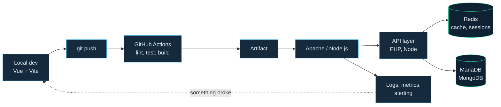
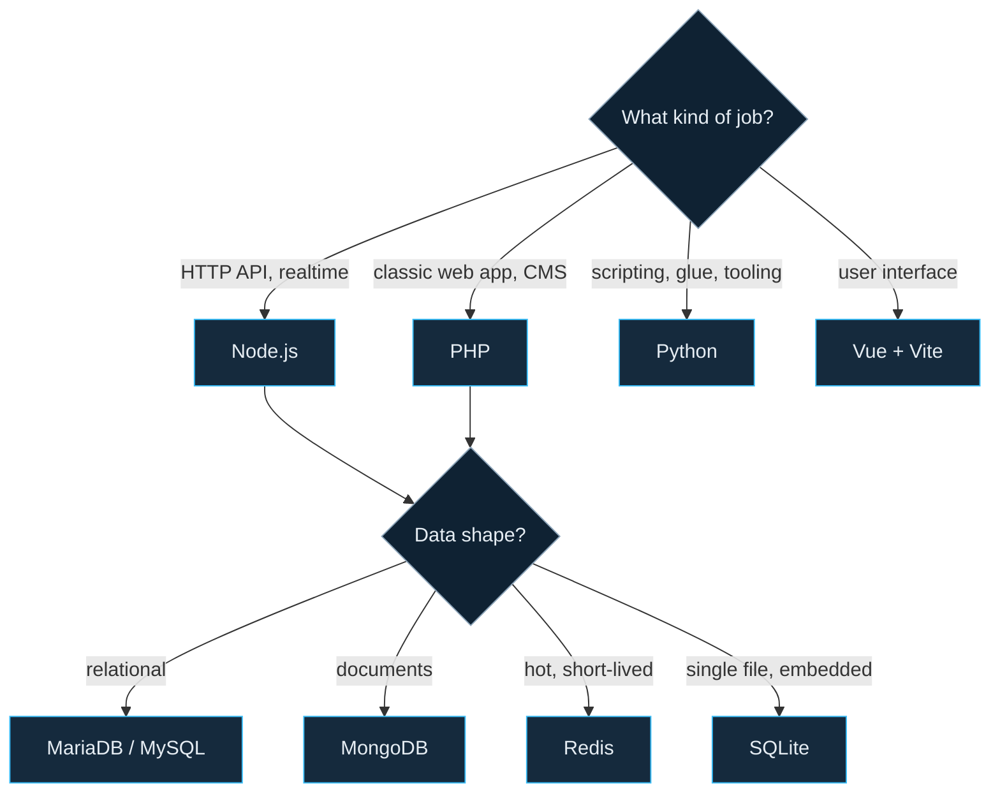

  <picture>
    <source media="(prefers-color-scheme: dark)" srcset="./assets/header-dark.svg">
    <source media="(prefers-color-scheme: light)" srcset="./assets/header-light.svg">
    
  </picture>

  
  
  

## 👋 About

Software developer from Germany, working at a hosting company. Most of my time goes into the parts users never see: APIs, deployment pipelines, database schemas and the automation that keeps all of it running without me.

<table>
<tr>
<td width="50%" valign="top">

**What I do**

- Backend services in **Node.js**, **TypeScript** and **PHP**, with **Vue** where a UI is needed
- The ops half of the job: **Linux**, **Apache**, **Redis**, **MariaDB**, cron and shell glue
- Automation that removes repetitive work – CI pipelines, scripts, bots

</td>
<td width="50%" valign="top">

**Right now**

- 🔨 Building **devprofile.dev**
- 📚 Learning **microservices** – service boundaries, messaging, observability
- ⚡ Maintaining **[proxy-scraper](https://github.com/maximilianfeix/proxy-scraper)**

</td>
</tr>
</table>

## 🧰 Tech stack

  <picture>
    <source media="(prefers-color-scheme: light)" srcset="https://skillicons.dev/icons?i=ts,js,php,py,java,cpp,html,css&theme=light&perline=12">
    
  </picture>

  <picture>
    <source media="(prefers-color-scheme: light)" srcset="https://skillicons.dev/icons?i=nodejs,vue,vite,mysql,mongodb,redis,sqlite&theme=light&perline=12">
    
  </picture>

  <picture>
    <source media="(prefers-color-scheme: light)" srcset="https://skillicons.dev/icons?i=linux,bash,githubactions,git,gitlab,figma,ps,ae,blender&theme=light&perline=12">
    
  </picture>

## 🛠️ How I work

| Principle | In practice |
|---|---|
| **Tested** | Tests that run offline and in CI – [proxy-scraper](https://github.com/maximilianfeix/proxy-scraper/actions/workflows/tests.yml) runs 450+ of them on Linux, macOS and Windows, against fake proxies and honeypots on `localhost` |
| **Reviewed** | Changes start as an issue and land through a reviewed pull request – see the [proxy-scraper history](https://github.com/maximilianfeix/proxy-scraper/pulls?q=is%3Apr+is%3Amerged) |
| **Automated** | Lint, CodeQL, Dependabot, tagged releases and scheduled jobs on GitHub Actions – this profile updates itself too |
| **Documented** | READMEs with a quick start, a changelog, contributing and security guides |

<b>From commit to production – and which tool for which job</b>

 

**What I reach for, and when**

## ⭐ Featured project

<table>
<tr>
<td>

### ⚡ [proxy-scraper](https://github.com/maximilianfeix/proxy-scraper)

**Free proxies that actually work.** Scrapes HTTP/SOCKS4/SOCKS5 proxies from 700+ sources and verifies every hit: honeypot filter, catches proxies that inject scripts (one in five does), HTTPS with verified TLS, anonymity, country and provider. It learns with every run which sources are worth it. Comes with a setup wizard, a live dashboard, a rotating proxy server (SOCKS5 + HTTP, sticky sessions, country per request, Prometheus metrics), a Python API and shell completion.

**→ [Browse the live list](https://maximilianfeix.github.io/proxy-scraper/)**, re-checked every 6 hours by GitHub Actions.

   

| 700+ | ~1M | 25 s | 3 OS |
|:---:|:---:|:---:|:---:|
| sources | candidates per run | to check them | Linux · macOS · Windows |

Python · asyncio · rich · Docker · GitHub Actions + Pages · 400+ offline tests on three operating systems

</td>
</tr>
</table>

## 🚀 Recently shipped

<!--SHIPPED:start-->
- 🔀 Merged [--serve-host for Docker](https://github.com/maximilianfeix/proxy-scraper/pull/57) in **proxy-scraper** · 25 Sep 2026
- 🔀 Merged [Website: provider column and datacenter filter](https://github.com/maximilianfeix/proxy-scraper/pull/58) in **proxy-scraper** · 25 Sep 2026
- 🔀 Merged [Provider per proxy and --no-datacenter](https://github.com/maximilianfeix/proxy-scraper/pull/56) in **proxy-scraper** · 25 Sep 2026
- 🔀 Merged [Proxy server v2: strategies, sessions, SOCKS5, status](https://github.com/maximilianfeix/proxy-scraper/pull/55) in **proxy-scraper** · 25 Sep 2026
- 🔀 Merged [Live list website](https://github.com/maximilianfeix/proxy-scraper/pull/52) in **proxy-scraper** · 25 Sep 2026
- 🔀 Merged [Catch proxies that inject scripts](https://github.com/maximilianfeix/proxy-scraper/pull/51) in **proxy-scraper** · 25 Sep 2026
<!--SHIPPED:end-->

## 📂 More projects

  

## 📈 GitHub activity

  

  <picture>
    <source media="(prefers-color-scheme: dark)" srcset="https://raw.githubusercontent.com/maximilianfeix/maximilianfeix/output/github-snake-dark.svg">
    <source media="(prefers-color-scheme: light)" srcset="https://raw.githubusercontent.com/maximilianfeix/maximilianfeix/output/github-snake.svg">
    
  </picture>

## ⚙️ Powered by GitHub Actions

This profile keeps itself up to date:

| Workflow | Status | What it does | When |
|---|---|---|---|
| [Profile](https://github.com/maximilianfeix/maximilianfeix/actions/workflows/profile.yml) |  | renders the banner with live data and the *Recently shipped* list ([script](scripts/build_profile.py)) | every 3 hours |
| [Metrics](https://github.com/maximilianfeix/maximilianfeix/actions/workflows/metrics.yml) |  | activity, languages, calendar and project cards via [lowlighter/metrics](https://github.com/lowlighter/metrics) | nightly |
| [Contribution snake](https://github.com/maximilianfeix/maximilianfeix/actions/workflows/main.yml) |  | turns the contribution graph into the snake above | nightly |
| [Link check](https://github.com/maximilianfeix/maximilianfeix/actions/workflows/links.yml) |  | makes sure every link in this README still works | weekly |

---

  Open to interesting backend and infrastructure work – the easiest way to reach me is an issue or discussion on one of my repositories. 
  Banner, project cards and stats are generated in this repository by GitHub Actions.

