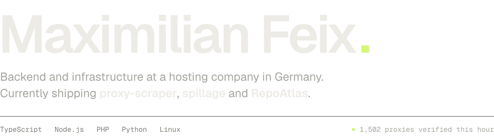
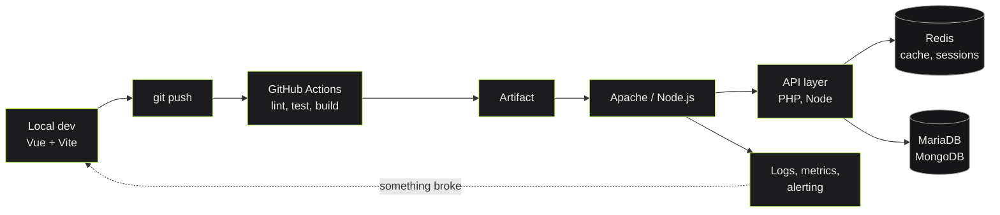
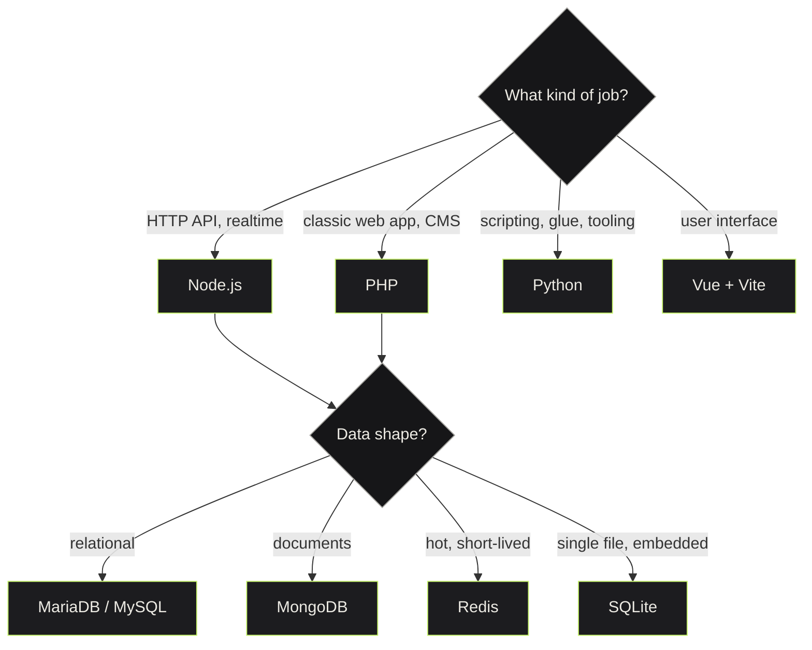
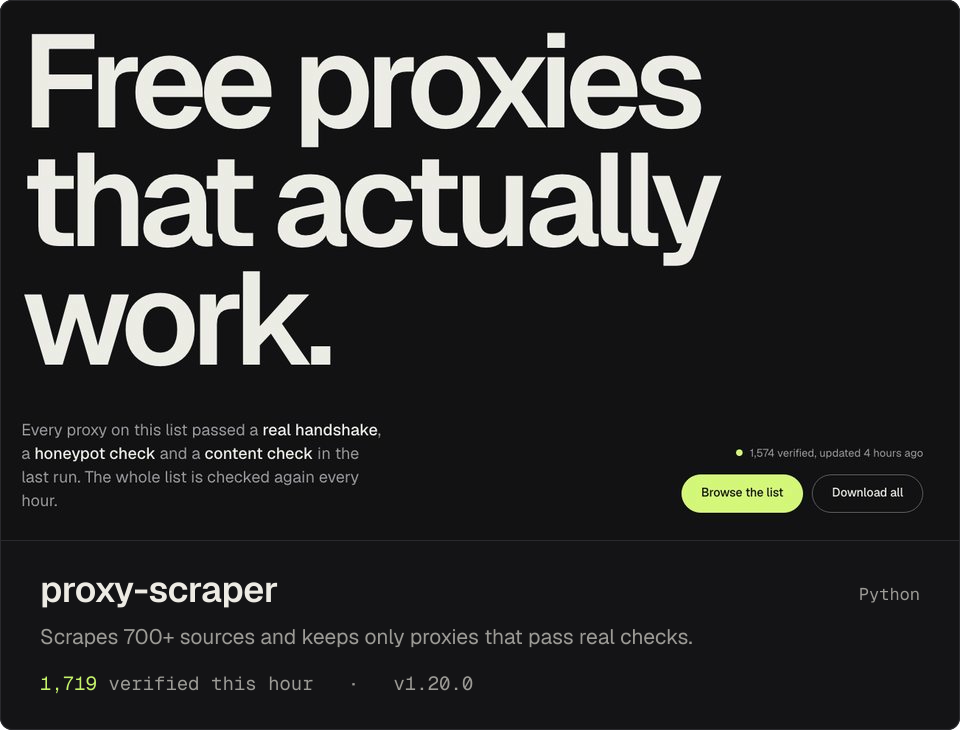
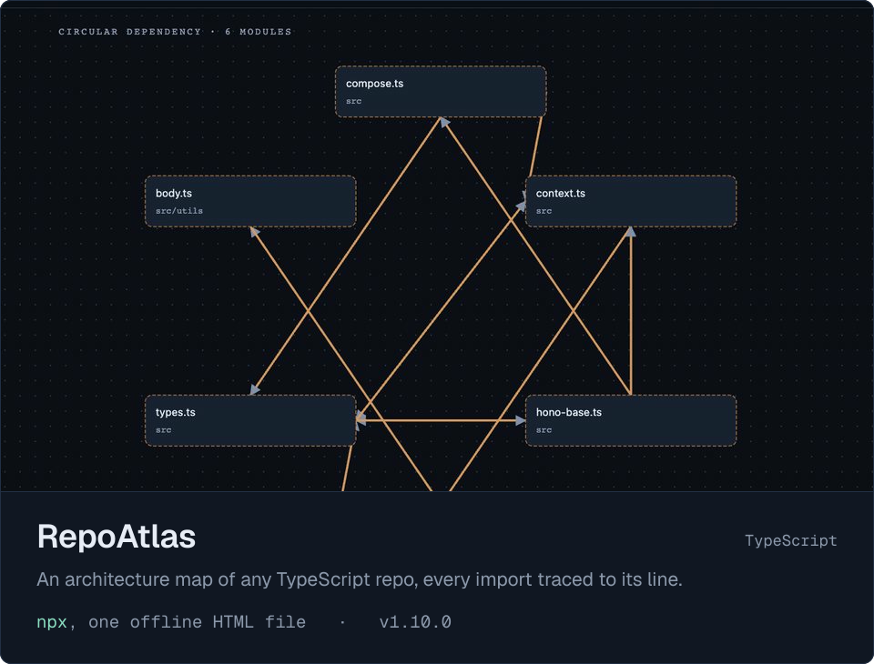

<p align="center">
  <picture>
    <source media="(prefers-color-scheme: dark)" srcset="./assets/header-dark.svg">
    <source media="(prefers-color-scheme: light)" srcset="./assets/header-light.svg">
    
  </picture>
</p>

## About

Software developer from Germany, working at a hosting company. Most of my time goes into the parts users never see: APIs, deployment pipelines, database schemas and the automation that keeps all of it running without me.

<table>
<tr>
<td width="50%" valign="top">

**What I do**

- Backend services in **Node.js**, **TypeScript** and **PHP**, with **Vue** where a UI is needed
- The ops half of the job: **Linux**, **Apache**, **Redis**, **MariaDB**, cron and shell glue
- Automation that removes repetitive work – CI pipelines, scripts, bots

</td>
<td width="50%" valign="top">

**Right now**

- 🔨 Building **devprofile.dev**
- 📚 Learning **microservices** – service boundaries, messaging, observability
- ⚡ Maintaining **[proxy-scraper](https://github.com/maximilianfeix/proxy-scraper)**
- 🗺️ Shipping **[RepoAtlas](https://github.com/maximilianfeix/repoatlas)** – architecture maps for TypeScript repos

</td>
</tr>
</table>

## Tech stack

<p align="center">
  <picture>
    <source media="(prefers-color-scheme: light)" srcset="https://skillicons.dev/icons?i=ts,js,php,py,java,cpp,html,css&theme=light&perline=12">
    
  </picture>
</p>
<p align="center">
  <picture>
    <source media="(prefers-color-scheme: light)" srcset="https://skillicons.dev/icons?i=nodejs,vue,vite,mysql,mongodb,redis,sqlite&theme=light&perline=12">
    
  </picture>
</p>
<p align="center">
  <picture>
    <source media="(prefers-color-scheme: light)" srcset="https://skillicons.dev/icons?i=linux,bash,githubactions,git,gitlab,figma,ps,ae,blender&theme=light&perline=12">
    
  </picture>
</p>

## How I work

| Principle | In practice |
|---|---|
| **Tested** | Tests that run offline and in CI – [proxy-scraper](https://github.com/maximilianfeix/proxy-scraper/actions/workflows/tests.yml) runs almost 500 of them on Linux, macOS and Windows, against fake proxies and honeypots on `localhost` |
| **Reviewed** | Changes start as an issue and land through a reviewed pull request – see the [proxy-scraper history](https://github.com/maximilianfeix/proxy-scraper/pulls?q=is%3Apr+is%3Amerged) |
| **Automated** | Lint, CodeQL, Dependabot, tagged releases and scheduled jobs on GitHub Actions – this profile updates itself too |
| **Documented** | READMEs with a quick start, a changelog, contributing and security guides |

<details>
<summary><b>From commit to production – and which tool for which job</b></summary>

<br>


```mermaid
flowchart LR
    dev["Local dev<br/>Vue + Vite"] --> push["git push"]
    push --> ci["GitHub Actions<br/>lint, test, build"]
    ci --> art["Artifact"]
    art --> web["Apache / Node.js"]
    web --> api["API layer<br/>PHP, Node"]
    api --> cache[("Redis<br/>cache, sessions")]
    api --> db[("MariaDB<br/>MongoDB")]
    web --> obs["Logs, metrics,<br/>alerting"]
    obs -.->|"something broke"| dev

    classDef node fill:#1C1C1F,stroke:#C6F36B,stroke-width:1px,color:#EDEBE4
    classDef store fill:#161618,stroke:#A3A29D,stroke-width:1px,color:#EDEBE4
    class dev,push,ci,art,web,api,obs node
    class cache,db store
```

**What I reach for, and when**


```mermaid
flowchart TD
    q{"What kind of job?"}
    q -->|"HTTP API, realtime"| n["Node.js"]
    q -->|"classic web app, CMS"| p["PHP"]
    q -->|"scripting, glue, tooling"| py["Python"]
    q -->|"user interface"| v["Vue + Vite"]
    n --> d1{"Data shape?"}
    p --> d1
    d1 -->|"relational"| m["MariaDB / MySQL"]
    d1 -->|"documents"| mo["MongoDB"]
    d1 -->|"hot, short-lived"| r["Redis"]
    d1 -->|"single file, embedded"| s["SQLite"]

    classDef node fill:#1C1C1F,stroke:#C6F36B,stroke-width:1px,color:#EDEBE4
    classDef decision fill:#161618,stroke:#A3A29D,stroke-width:1px,color:#EDEBE4
    class n,p,py,v,m,mo,r,s node
    class q,d1 decision
```

</details>

## Featured projects

<p align="center">
  <a href="https://github.com/maximilianfeix/proxy-scraper"></a>
  <a href="https://github.com/maximilianfeix/repoatlas"></a>
</p>

<p align="center"><sub>Real screenshots, live numbers – rebuilt every 3 hours by this repository's workflow.</sub></p>

### [proxy-scraper](https://github.com/maximilianfeix/proxy-scraper) &nbsp;<sub>Python</sub>

**Free proxies that actually work.** Scrapes HTTP/SOCKS4/SOCKS5 proxies from 700+ sources and verifies every hit: honeypot filter, catches proxies that inject scripts (one in five does), HTTPS with verified TLS, anonymity, country, provider and spam blocklists – and learns with every run which sources are worth it.

- **Rotating proxy server** – SOCKS5 + HTTP, sticky sessions, country per request, refills itself, Prometheus metrics
- **MCP server** – AI agents like Claude Code get working proxies and can load pages through them
- **Everything around it** – setup wizard, live dashboard, Discord bot, Python API, Docker, shell completion

<a href="https://github.com/maximilianfeix/proxy-scraper/actions/workflows/tests.yml"></a> <a href="https://github.com/maximilianfeix/proxy-scraper/releases/latest"></a> <a href="https://github.com/maximilianfeix/proxy-scraper/tree/proxy-list"></a> <a href="https://github.com/maximilianfeix/proxy-scraper/stargazers"></a>

| 700+ | ~1M | 25 s | 3 OS |
|:---:|:---:|:---:|:---:|
| sources | candidates per run | to check them | Linux · macOS · Windows |

**→ [Browse the live list](https://maximilianfeix.github.io/proxy-scraper/)**, re-checked every hour by GitHub Actions.

<details>
<summary><b>Screenshot of the live list</b></summary>
<br>
<a href="https://maximilianfeix.github.io/proxy-scraper/"></a>
</details>

### [RepoAtlas](https://github.com/maximilianfeix/repoatlas) &nbsp;<sub>TypeScript</sub>

**Understand any TypeScript repo in one interactive map.** RepoAtlas parses every import with the TypeScript compiler API and turns a project into a standalone architecture map – entry points, modules, dependencies. Unlike a diagram guessed from prose, every connection links to the exact import statement and line that proves it.

- **Evidence, not guesses** – click any edge to see the source line, with a commit-pinned GitHub link
- **Assess change** – Focus map for direct neighbours, Impact map for everything that transitively depends on a module, circular import groups isolated edge by edge
- **Zero setup** – one `npx` command, no clone, no API key; the output is a single offline HTML file (or JSON), also as a [GitHub Action](https://github.com/maximilianfeix/repoatlas#github-actions)

```sh
npx --yes --package=github:maximilianfeix/repoatlas -- repoatlas https://github.com/pmndrs/zustand -o zustand-map.html
```

<a href="https://github.com/maximilianfeix/repoatlas/actions/workflows/ci.yml"></a> <a href="https://github.com/maximilianfeix/repoatlas/actions/workflows/codeql.yml"></a> <a href="https://github.com/maximilianfeix/repoatlas/releases/latest"></a> <a href="https://github.com/maximilianfeix/repoatlas/stargazers"></a>

| Try it on | Modules | Connections |
|---|:---:|:---:|
| [**Zustand** – open map](https://maximilianfeix.github.io/repoatlas/examples/zustand.html) | 18 | 23 |
| [**Ky** – open map](https://maximilianfeix.github.io/repoatlas/examples/ky.html) | 51 | 93 |
| [**Hono** – open map](https://maximilianfeix.github.io/repoatlas/examples/hono.html) | 247 | 676 |

<a href="https://maximilianfeix.github.io/repoatlas/examples/hono.html"></a>

<sub>TypeScript 6 compiler API · Node.js 22+ · no network requests from the viewer · hash-based CSP · tests + CodeQL on every push</sub>

## Recently shipped

<!--SHIPPED:start-->
- 🏷️ Released **[repoatlas v2.41.0](https://github.com/maximilianfeix/repoatlas/releases/tag/v2.41.0)** <sub>· 28 Sep 2026</sub>
- 🔀 Merged [Add README-ready Mermaid architecture reports](https://github.com/maximilianfeix/repoatlas/pull/166) in **repoatlas** <sub>· 28 Sep 2026</sub>
- 🔀 Merged [Polish RepoAtlas visual identity](https://github.com/maximilianfeix/repoatlas/pull/164) in **repoatlas** <sub>· 28 Sep 2026</sub>
- 🏷️ Released **[repoatlas v2.40.2](https://github.com/maximilianfeix/repoatlas/releases/tag/v2.40.2)** <sub>· 28 Sep 2026</sub>
- 🔀 Merged [fix: version browser worker cache by release](https://github.com/maximilianfeix/repoatlas/pull/162) in **repoatlas** <sub>· 28 Sep 2026</sub>
- 🏷️ Released **[repoatlas v2.40.1](https://github.com/maximilianfeix/repoatlas/releases/tag/v2.40.1)** <sub>· 28 Sep 2026</sub>
<!--SHIPPED:end-->

## More projects

<p align="center">
  
</p>

## GitHub activity

<p align="center">
  
</p>

<p align="center">
  <picture>
    <source media="(prefers-color-scheme: dark)" srcset="https://raw.githubusercontent.com/maximilianfeix/maximilianfeix/output/github-snake-dark.svg">
    <source media="(prefers-color-scheme: light)" srcset="https://raw.githubusercontent.com/maximilianfeix/maximilianfeix/output/github-snake.svg">
    
  </picture>
</p>

## Powered by GitHub Actions

This profile keeps itself up to date:

| Workflow | Status | What it does | When |
|---|---|---|---|
| [Profile](https://github.com/maximilianfeix/maximilianfeix/actions/workflows/profile.yml) | [](https://github.com/maximilianfeix/maximilianfeix/actions/workflows/profile.yml) | renders the banner and project cards with live data and the *Recently shipped* list ([script](scripts/build_profile.py)) | every 3 hours |
| [Metrics](https://github.com/maximilianfeix/maximilianfeix/actions/workflows/metrics.yml) | [](https://github.com/maximilianfeix/maximilianfeix/actions/workflows/metrics.yml) | activity, languages, calendar and project cards via [lowlighter/metrics](https://github.com/lowlighter/metrics) | nightly |
| [Contribution snake](https://github.com/maximilianfeix/maximilianfeix/actions/workflows/main.yml) | [](https://github.com/maximilianfeix/maximilianfeix/actions/workflows/main.yml) | turns the contribution graph into the snake above | nightly |
| [Link check](https://github.com/maximilianfeix/maximilianfeix/actions/workflows/links.yml) | [](https://github.com/maximilianfeix/maximilianfeix/actions/workflows/links.yml) | makes sure every link in this README still works | weekly |

---

<p align="center">
  <sub>Open to interesting backend and infrastructure work – the easiest way to reach me is an issue or discussion on one of my repositories.</sub><br>
  <sub>Banner, project cards and stats are generated in this repository by GitHub Actions.</sub>
</p>
