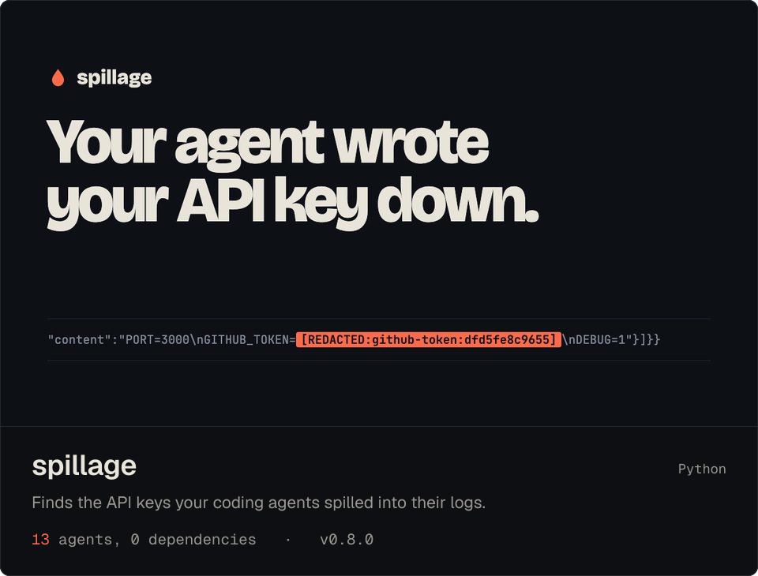
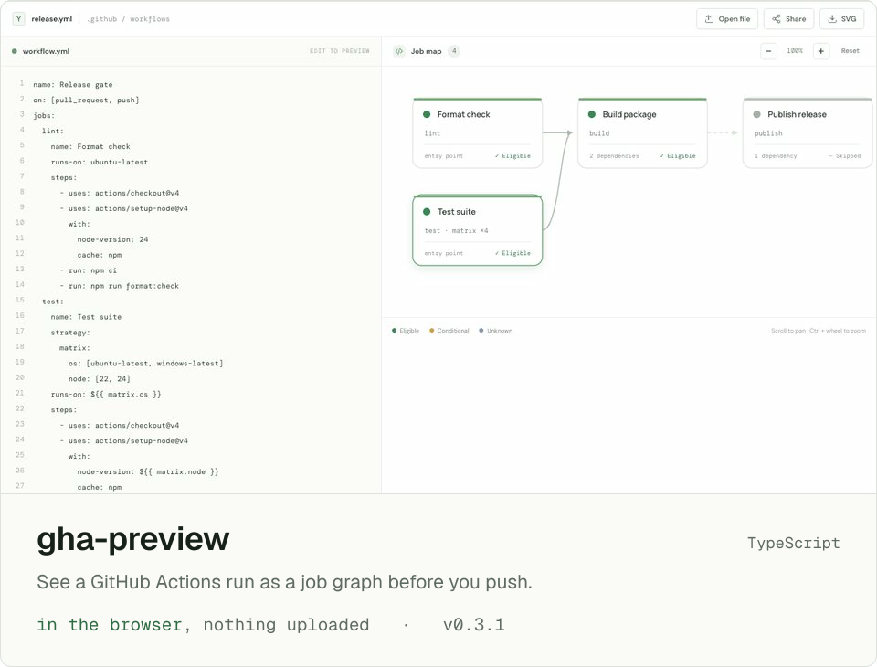
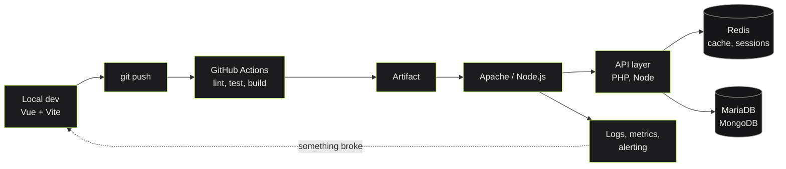

<p align="center">
  <picture>
    <source media="(prefers-color-scheme: dark)" srcset="./assets/header-dark.svg">
    <source media="(prefers-color-scheme: light)" srcset="./assets/header-light.svg">
    
  </picture>
</p>

<p align="center">
  <samp>
    <a href="#projects">projects</a> ·
    <a href="#open-source">open source</a> ·
    <a href="#how-i-work">how i work</a> ·
    <a href="#stack">stack</a> ·
    <a href="#activity">activity</a>
  </samp>
</p>

Software developer from Germany, working at a hosting company. Most of my time goes into the parts users never see: APIs, deployment pipelines, database schemas and the automation that keeps all of it running without me. In my own time I build developer tools that do one job properly and show their work – tested, documented, released.

<table>
<tr>
<td width="50%" valign="top">

**What I do**

- Backend services in **Node.js**, **TypeScript**, **PHP** and **Python**, with **Vue** where a UI is needed
- The ops half of the job: **Linux**, **Apache**, **Redis**, **MariaDB**, cron and shell glue
- Automation that removes repetitive work – CI pipelines, scripts, bots

</td>
<td width="50%" valign="top">

**Right now**

- 🔐 Shipping **[spillage](https://github.com/maximilianfeix/spillage)** – secret scanning for coding-agent logs
- ⚡ Maintaining **[proxy-scraper](https://github.com/maximilianfeix/proxy-scraper)** and **[RepoAtlas](https://github.com/maximilianfeix/repoatlas)**
- 🔨 Building **devprofile.dev**
- 📚 Learning **microservices** – service boundaries, messaging, observability

</td>
</tr>
</table>

<a id="projects"></a>

## Projects

<p align="center">
  <a href="#proxy-scraper"></a>
  <a href="#spillage"></a>
</p>
<p align="center">
  <a href="#repoatlas"></a>
  <a href="#gha-preview"></a>
</p>

<p align="center"><sub>Real screenshots, live numbers – rebuilt every 3 hours by this repository's workflow.</sub></p>

<a id="proxy-scraper"></a>

### [proxy-scraper](https://github.com/maximilianfeix/proxy-scraper) &nbsp;<sub>Python</sub>

**Free proxies that actually work.** Scrapes HTTP/SOCKS4/SOCKS5 proxies from 700+ sources and verifies every hit: honeypot filter, catches proxies that inject scripts (one in five does), HTTPS with verified TLS, anonymity, country, provider and spam blocklists – and learns with every run which sources are worth it. Comes with a rotating proxy server (SOCKS5 + HTTP, sticky sessions, Prometheus metrics), an MCP server for AI agents, a live dashboard and a Discord bot.

<a href="https://github.com/maximilianfeix/proxy-scraper/actions/workflows/tests.yml"></a> <a href="https://github.com/maximilianfeix/proxy-scraper/releases/latest"></a> <a href="https://github.com/maximilianfeix/proxy-scraper/tree/proxy-list"></a> <a href="https://github.com/maximilianfeix/proxy-scraper/stargazers"></a>

| 700+ | ~1M | 25 s | ~500 |
|:---:|:---:|:---:|:---:|
| sources | candidates per run | to check them | tests on Linux · macOS · Windows |

**→ [Browse the live list](https://maximilianfeix.github.io/proxy-scraper/)**, re-checked every hour by GitHub Actions.

<a id="spillage"></a>

### [spillage](https://github.com/maximilianfeix/spillage) &nbsp;<sub>Python</sub>

**Find the API keys your coding agents spilled into their logs.** Claude Code, Codex, Gemini CLI, Cursor and the rest keep every conversation on disk as plain text – including each `.env` they read and every key you pasted "just to test". spillage reads the logs of thirteen agents, tells you which keys leaked and *how* (you pasted it, a tool printed it, the model repeated it), links to the page where you rotate each one, scrubs them without breaking `--resume`, and installs hooks that block the next leak.

- **56 rules** that know each key's exact shape – GitHub tokens are checked against their CRC32, JWTs have to decode, placeholders are skipped
- **Zero dependencies, zero network** – standard library only, secrets are only ever shown masked
- **Fits into CI** – HTML, JSON, Markdown and SARIF reports, a GitHub Action and a pre-commit hook

```sh
brew install maximilianfeix/tap/spillage && spillage
```

<a href="https://github.com/maximilianfeix/spillage/releases/latest"></a>  <a href="https://maximilianfeix.github.io/spillage/"></a>

<a id="repoatlas"></a>

### [RepoAtlas](https://github.com/maximilianfeix/repoatlas) &nbsp;<sub>TypeScript</sub>

**Understand any TypeScript repo in one interactive map.** RepoAtlas parses every import with the TypeScript compiler API and turns a project into a standalone architecture map. Unlike a diagram guessed from prose, every connection links to the exact import statement and line that proves it – with a Focus map for direct neighbours, an Impact map for everything that transitively depends on a module, and circular import groups isolated edge by edge.

```sh
npx --yes --package=github:maximilianfeix/repoatlas -- repoatlas https://github.com/pmndrs/zustand -o zustand-map.html
```

<a href="https://github.com/maximilianfeix/repoatlas/actions/workflows/ci.yml"></a> <a href="https://github.com/maximilianfeix/repoatlas/actions/workflows/codeql.yml"></a> <a href="https://github.com/maximilianfeix/repoatlas/releases/latest"></a>

Try it on real projects: [**Zustand**](https://maximilianfeix.github.io/repoatlas/examples/zustand.html) <sub>18 modules</sub> · [**Ky**](https://maximilianfeix.github.io/repoatlas/examples/ky.html) <sub>51 modules</sub> · [**Hono**](https://maximilianfeix.github.io/repoatlas/examples/hono.html) <sub>247 modules, 676 connections</sub>

<a id="gha-preview"></a>

### [gha-preview](https://github.com/maximilianfeix/gha-preview) &nbsp;<sub>TypeScript</sub>

**See the run before the run.** Paste a GitHub Actions workflow and explore it as a job graph: which jobs a `push` or `pull_request` would start, what a matrix expands to, how a proposed change reshapes the pipeline – and jump from any job straight back to its YAML line. Everything is parsed in the browser; no account, no upload.

<a href="https://github.com/maximilianfeix/gha-preview/actions/workflows/ci.yml"></a> <a href="https://github.com/maximilianfeix/gha-preview/releases/latest"></a> <a href="https://maximilianfeix.github.io/gha-preview/"></a>

<details>
<summary><b>Smaller things</b></summary>

<br>

| Repository | What it is |
|---|---|
| [free-proxy-list](https://github.com/maximilianfeix/free-proxy-list) | The hourly proxy list from proxy-scraper, per country, as JSON and CSV |
| [homebrew-tap](https://github.com/maximilianfeix/homebrew-tap) | Homebrew formulae – `brew install maximilianfeix/tap/spillage` |
| [AxonPHPCLI](https://github.com/maximilianfeix/AxonPHPCLI) | Tiny PHP CLI that generates GitHub Actions CI/CD configuration for PHP projects |
| [Mini-Laravel](https://github.com/maximilianfeix/Mini-Laravel) | Laravel-style PHP framework from scratch: router, DI container, controllers, middleware |
| [CurrentlyFreeDomains](https://github.com/maximilianfeix/CurrentlyFreeDomains) | Currently free `.de` domains |
| [C++ template for macOS](https://github.com/maximilianfeix/C--Template-fr-Mac) · [vocational school C++](https://github.com/maximilianfeix/Berufsschule-Anwendungsentwicklung-C-) | Starter template with VS Code tasks, and exercises from my apprenticeship |

</details>

<a id="open-source"></a>

## Open source

<table>
<tr>
<td width="55%" valign="top">

**Recently shipped**

<!--SHIPPED:start-->
- 🏷️ Released **[AxonPHPCLI v0.5.1](https://github.com/maximilianfeix/AxonPHPCLI/releases/tag/v0.5.1)** <sub>· 04 Oct 2026</sub>
- 🔀 Merged [AxonPHP CLI 0.5.1](https://github.com/maximilianfeix/AxonPHPCLI/pull/22) in **AxonPHPCLI** <sub>· 04 Oct 2026</sub>
- 🔀 Merged [README: Nachrichtenlage als optional kennzeichnen](https://github.com/maximilianfeix/aktien-radar/pull/12) in **aktien-radar** <sub>· 03 Oct 2026</sub>
- 🔀 Merged [Radar v3: neues Design, 240 Werte, Screener, Vergleich, News und Depot-Check](https://github.com/maximilianfeix/aktien-radar/pull/10) in **aktien-radar** <sub>· 03 Oct 2026</sub>
- 🏷️ Released **[proxy-scraper v1.23.0](https://github.com/maximilianfeix/proxy-scraper/releases/tag/v1.23.0)** <sub>· 02 Oct 2026</sub>
- 🔀 Merged [release 1.23.0](https://github.com/maximilianfeix/proxy-scraper/pull/246) in **proxy-scraper** <sub>· 02 Oct 2026</sub>
<!--SHIPPED:end-->

</td>
<td width="45%" valign="top">

**Contributions to other projects**

<!--CONTRIB:start-->
- **[HKUDS/DeepTutor](https://github.com/HKUDS/DeepTutor)** <sub>★ 40.8k</sub><br><sub>[2 merged PRs](https://github.com/HKUDS/DeepTutor/pulls?q=is%3Apr+is%3Amerged+author%3Amaximilianfeix)</sub>
- **[semantica-agi/semantica](https://github.com/semantica-agi/semantica)** <sub>★ 13.7k</sub><br><sub>[6 merged PRs](https://github.com/semantica-agi/semantica/pulls?q=is%3Apr+is%3Amerged+author%3Amaximilianfeix)</sub>
- **[MakazhanAlpamys/Soup](https://github.com/MakazhanAlpamys/Soup)** <sub>★ 8.2k</sub><br><sub>[6 merged PRs](https://github.com/MakazhanAlpamys/Soup/pulls?q=is%3Apr+is%3Amerged+author%3Amaximilianfeix)</sub>
- **[hetzneronline/community-content](https://github.com/hetzneronline/community-content)** <sub>★ 463</sub><br><sub>[3 merged PRs](https://github.com/hetzneronline/community-content/pulls?q=is%3Apr+is%3Amerged+author%3Amaximilianfeix)</sub>
- **[ldbumble/taskuary](https://github.com/ldbumble/taskuary)** <sub>★ 135</sub><br><sub>[15 merged PRs](https://github.com/ldbumble/taskuary/pulls?q=is%3Apr+is%3Amerged+author%3Amaximilianfeix)</sub>
- **[intuit/stunt-double](https://github.com/intuit/stunt-double)** <sub>★ 15</sub><br><sub>[4 merged PRs](https://github.com/intuit/stunt-double/pulls?q=is%3Apr+is%3Amerged+author%3Amaximilianfeix)</sub>
<!--CONTRIB:end-->

</td>
</tr>
</table>

<a id="how-i-work"></a>

## How I work

| Principle | In practice |
|---|---|
| **Tested** | Tests that run offline and in CI – [proxy-scraper](https://github.com/maximilianfeix/proxy-scraper/actions/workflows/tests.yml) runs almost 500 of them on Linux, macOS and Windows, against fake proxies and honeypots on `localhost` |
| **Reviewed** | Changes start as an issue and land through a reviewed pull request – see the [proxy-scraper history](https://github.com/maximilianfeix/proxy-scraper/pulls?q=is%3Apr+is%3Amerged) |
| **Automated** | Lint, CodeQL, Dependabot, tagged releases and scheduled jobs on GitHub Actions – this profile updates itself too |
| **Minimal** | As few dependencies as the job allows – spillage has none, because it's a tool you point at your secrets |
| **Documented** | READMEs with a quick start, a changelog, contributing and security guides |

<details>
<summary><b>From commit to production – and which tool for which job</b></summary>

<br>


```mermaid
flowchart LR
    dev["Local dev<br/>Vue + Vite"] --> push["git push"]
    push --> ci["GitHub Actions<br/>lint, test, build"]
    ci --> art["Artifact"]
    art --> web["Apache / Node.js"]
    web --> api["API layer<br/>PHP, Node"]
    api --> cache[("Redis<br/>cache, sessions")]
    api --> db[("MariaDB<br/>MongoDB")]
    web --> obs["Logs, metrics,<br/>alerting"]
    obs -.->|"something broke"| dev

    classDef node fill:#1C1C1F,stroke:#C6F36B,stroke-width:1px,color:#EDEBE4
    classDef store fill:#161618,stroke:#A3A29D,stroke-width:1px,color:#EDEBE4
    class dev,push,ci,art,web,api,obs node
    class cache,db store
```

**What I reach for, and when**


```mermaid
flowchart TD
    q{"What kind of job?"}
    q -->|"HTTP API, realtime"| n["Node.js"]
    q -->|"classic web app, CMS"| p["PHP"]
    q -->|"CLI tools, scripting, glue"| py["Python"]
    q -->|"user interface"| v["Vue + Vite"]
    n --> d1{"Data shape?"}
    p --> d1
    d1 -->|"relational"| m["MariaDB / MySQL"]
    d1 -->|"documents"| mo["MongoDB"]
    d1 -->|"hot, short-lived"| r["Redis"]
    d1 -->|"single file, embedded"| s["SQLite"]

    classDef node fill:#1C1C1F,stroke:#C6F36B,stroke-width:1px,color:#EDEBE4
    classDef decision fill:#161618,stroke:#A3A29D,stroke-width:1px,color:#EDEBE4
    class n,p,py,v,m,mo,r,s node
    class q,d1 decision
```

</details>

<a id="stack"></a>

## Stack

<p align="center">
  <picture>
    <source media="(prefers-color-scheme: light)" srcset="https://skillicons.dev/icons?i=ts,js,py,php,java,cpp,nodejs,vue,vite,html,css&theme=light&perline=11">
    
  </picture>
</p>
<p align="center">
  <picture>
    <source media="(prefers-color-scheme: light)" srcset="https://skillicons.dev/icons?i=linux,bash,docker,mysql,mongodb,redis,sqlite,prometheus,githubactions,git,gitlab&theme=light&perline=11">
    
  </picture>
</p>
<p align="center"><sub>Also at home in Figma, Photoshop, After Effects and Blender.</sub></p>

<a id="activity"></a>

## Activity

<p align="center">
  
</p>

<p align="center">
  <picture>
    <source media="(prefers-color-scheme: dark)" srcset="https://raw.githubusercontent.com/maximilianfeix/maximilianfeix/output/github-snake-dark.svg">
    <source media="(prefers-color-scheme: light)" srcset="https://raw.githubusercontent.com/maximilianfeix/maximilianfeix/output/github-snake.svg">
    
  </picture>
</p>

<details>
<summary><b>How this profile updates itself</b></summary>

<br>

| Workflow | Status | What it does | When |
|---|---|---|---|
| [Profile](https://github.com/maximilianfeix/maximilianfeix/actions/workflows/profile.yml) | [](https://github.com/maximilianfeix/maximilianfeix/actions/workflows/profile.yml) | renders the banner and project cards with live data (text set with HarfBuzz, so it looks the same everywhere), plus *Recently shipped* and *Contributions* ([script](scripts/build_profile.py)) | every 3 hours |
| [Metrics](https://github.com/maximilianfeix/maximilianfeix/actions/workflows/metrics.yml) | [](https://github.com/maximilianfeix/maximilianfeix/actions/workflows/metrics.yml) | activity, languages and calendar via [lowlighter/metrics](https://github.com/lowlighter/metrics) | nightly |
| [Contribution snake](https://github.com/maximilianfeix/maximilianfeix/actions/workflows/main.yml) | [](https://github.com/maximilianfeix/maximilianfeix/actions/workflows/main.yml) | turns the contribution graph into the snake above | nightly |
| [Link check](https://github.com/maximilianfeix/maximilianfeix/actions/workflows/links.yml) | [](https://github.com/maximilianfeix/maximilianfeix/actions/workflows/links.yml) | makes sure every link in this README still works | weekly |

</details>

---

<p align="center">
  <sub>Open to interesting backend and infrastructure work – the easiest way to reach me is an issue or discussion on one of my repositories.</sub>
</p>
